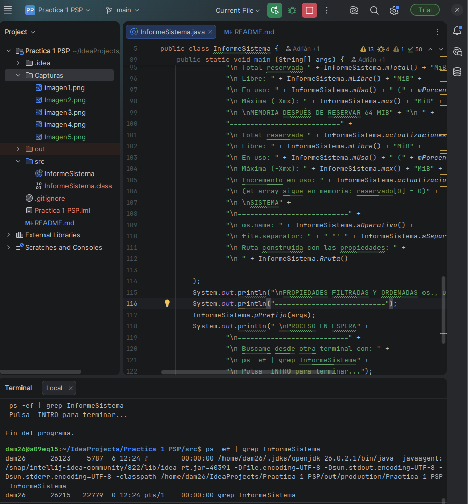
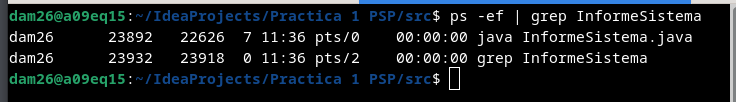
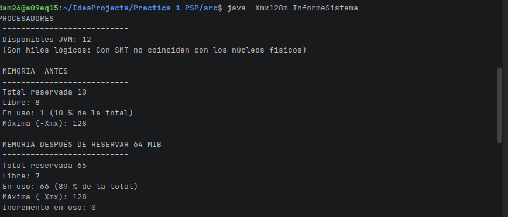
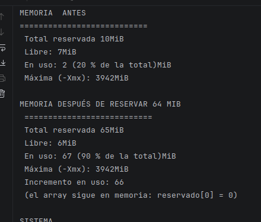
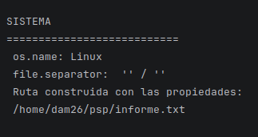
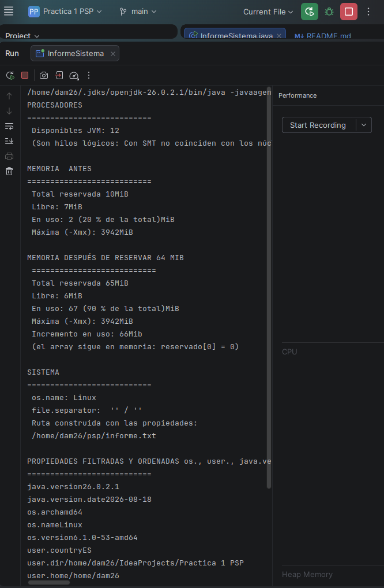
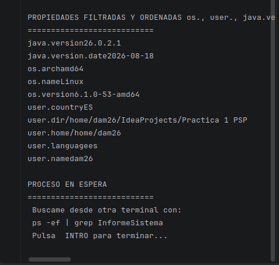
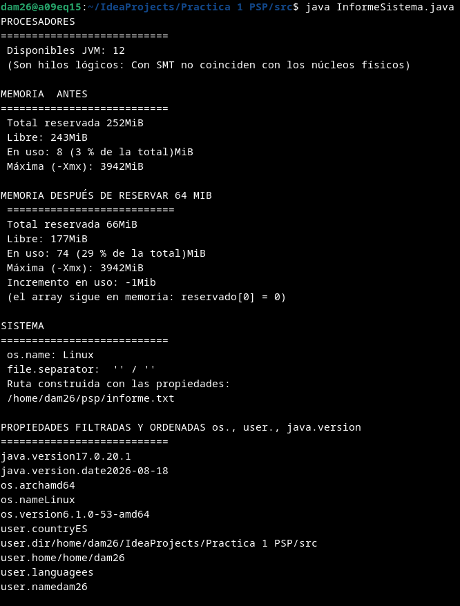
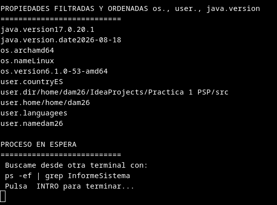

NOTA: EN LAS CAPTURAS APARECE EL NÚMERO DE MI SITIO COMO CONFIRMACIÓN DE QUE LO HICE YO, SI NECESITAS MAS AVÍSAME.

1) Anotad su PID y su PPID, y explicad qué proceso es el padre y por qué es ese.

Repetid la búsqueda lanzando el programa de dos formas: desde la terminal y desde vuestro
IDE. ¿Cambia el PPID? ¿Por qué?

PID: 6678

PPID: 5787

EXPLICACIÓN:
Si nos fijamos en la imagen encontramos el parámetro "-javaagent:/snap/intellij-idea-community/"..etc, este confirma que el programa se lanzó en el IDE de IntelliJ y es el padre. El PPID 5787 corresponde a este.

Esto lo se porque que lance el comando "ps -ef | head -n 1; ps -ef | grep [I]nformeSistema" que muestra la información mas legible. Esto lo que saque de Gemini con el siguiente PROMPT:

"ps -ef | grep InformeSistema ... (salida) Como hago esta línea mas legible".

PPID significa: "Parent Process ID" lo que lo indica aun mas claramente.

Vemos que cambia a 22626, eso es porque en vez de lanzarlo en Intellij lo hace desde termianl, por tanto se le asigna uno diferente.

2) Ejecutadlo después con java -Xmx128m InformeSistema y comparad las cuatro cifras de
   memoria con las de la ejecución normal. Indicad cuáles cambian, cuáles no y por qué.

   
(java -Xmx128m InformeSistema tendrá un estilo diferente porque cuando lo lance no había terminado de pulir la salida por terminal)

Cambia el valor de memoria libre a 8, procesadores 1 y memoria máxima a 128

3) Por último, indicad qué ruta genera vuestro programa en el apartado multiplataforma y qué
   ruta generaría en el otro sistema operativo, explicando de dónde sale la diferencia

En este sistema: 

Ruta: /home/dam26/psp/informe.txt
S.O: Linux
Seperador: /

En otro: C:\home\dam26\psp\informe.txt
S.O: Windows
Separador: \

La diferencia erradica en que cada S.O tiene su tipo de sistema de archoivos, que guarda las cosas de forma diferente

● a) Un servidor web que atiende 500 peticiones a la vez en una máquina de 8 núcleos.

Coincide en Programación paralela y Programación concurrente.

Paralela: Al tener 8 nucleos puede procesar 8 peticiones al mismo tiempo.

Concurrente: Va intercalando el tiempo en CPU.

● b) Renderizar una película de animación en un plazo de tres meses.

Distribuido: Muchos servidores trabajan juntos para renderizar una parte de la película distinta.

Paralelo: Todos los servidores Trabaján unidos para renderizar una parte asignada

Pueden trabajar solos o unidos

● c) Una app de móvil que descarga un fichero mientras seguís navegando.

Concurrente: Pone en segundo plano la descarga y así no se ve y puedes seguir trabajando.

● d) Un cálculo que no cabe en la RAM de un solo equipo

Distribuida: Es inviable hacerlo en una sola así que se reparte la carga entre varias máquinas.

2 EJECUCIONES

